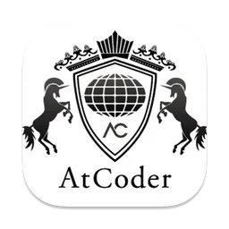

<p align="center">
    
    <h1 align="center">AtCoder API</h1>
    <p align="center">開催予定のコンテストを取得する非公式APIです</p>
</p>

## About
AtCoder株式会社が開催するプログラミングコンテスト[AtCoder](https://atcoder.jp)の開催予定のコンテストの情報を取得することができる非公式APIです。

情報は5分毎に更新されます。

デプロイ先はRailwayです。

## How to use
GETメソッドを使用し、JSON形式のコンテスト情報を得ることができます。
### エンドポイント
| データ                                     | エンドポイント                                                              |
| ------------------------------------------ | --------------------------------------------------------------------------- |
| 開催予定となっているコンテスト一覧         | https://atcoderapi-production.up.railway.app/api/upcoming-contests          |
| 開催予定となっているBeginnerコンテスト一覧 | https://atcoderapi-production.up.railway.app/api/upcoming-contests/ABC      |
| 最も早く開催される次回のコンテスト         | https://atcoderapi-production.up.railway.app/api/upcoming-contests/next     |
| 最も早く開催される次回のBeginnerコンテスト | https://atcoderapi-production.up.railway.app/api/upcoming-contests/ABC/next |


## Example
### Javascriptを用いてJSONを処理するサンプルコード
```js
fetch('http://localhost:8000/api/upcoming-contests')
  .then(response => response.json())
  .then(data => {
    // 取得したJSONデータを処理する
    data.forEach(contest => {
      console.log('Contest Title:', contest.title);
      console.log('Start Time:', contest.time);
      console.log('Link:', contest.link);
      console.log('Unix Time:', contest.unixTime);
      console.log('Duration:', contest.duration);
      console.log('------------------------');
    });
  })
  .catch(error => {
    console.error('Error fetching data:', error);
  });
```
### GETによるJSONのレスポンス例
```JSON
[
    {
        "time": "2024-03-22 19:00:00+0900",
        "title": "MC Digital Programming Contest 2024（AtCoder Heuristic Contest 031）",
        "link": "https://atcoder.jp/contests/ahc031?lang=en",
        "unixTime": 1711101600,
        "duration": 51888
    },
    {
        "time": "2024-03-23 21:00:00+0900",
        "title": "UNIQUE VISION Programming Contest 2024 Spring(AtCoder Beginner Contest 346)",
        "link": "https://atcoder.jp/contests/abc346?lang=en",
        "unixTime": 1711195200,
        "duration": 145488
    },
    {
        "time": "2024-03-24 21:00:00+0900",
        "title": "AtCoder Regular Contest 175",
        "link": "https://atcoder.jp/contests/arc175?lang=en",
        "unixTime": 1711281600,
        "duration": 231888
    },
    {
        "time": "2024-03-30 21:00:00+0900",
        "title": "AtCoder Beginner Contest 347",
        "link": "https://atcoder.jp/contests/abc347?lang=en",
        "unixTime": 1711800000,
        "duration": 750288
    },
    {
        "time": "2024-03-31 21:00:00+0900",
        "title": "AtCoder Grand Contest 066",
        "link": "https://atcoder.jp/contests/agc066?lang=en",
        "unixTime": 1711886400,
        "duration": 836688
    },
    {
        "time": "2024-04-07 19:00:00+0900",
        "title": "AtCoder Heuristic Contest 032",
        "link": "https://atcoder.jp/contests/ahc032?lang=en",
        "unixTime": 1712484000,
        "duration": 1434288
    },
    {
        "time": "2024-04-13 21:00:00+0900",
        "title": "AtCoder Beginner Contest 349",
        "link": "https://atcoder.jp/contests/abc349?lang=en",
        "unixTime": 1713009600,
        "duration": 1959888
    },
    {
        "time": "2024-04-20 21:00:00+0900",
        "title": "AtCoder Beginner Contest 350",
        "link": "https://atcoder.jp/contests/abc350?lang=en",
        "unixTime": 1713614400,
        "duration": 2564688
    }
]
```


## Warning
- デプロイ先は予告なく変更される場合があり, URLを使用しているプログラムに影響を及ぼす可能性があります。
- 制作者はコーディング初学者です。誤りを見つけられましたら、お気軽にご指摘ください。
